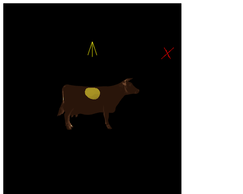
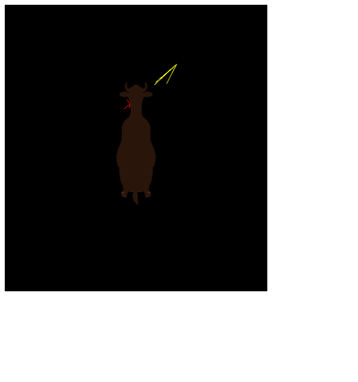
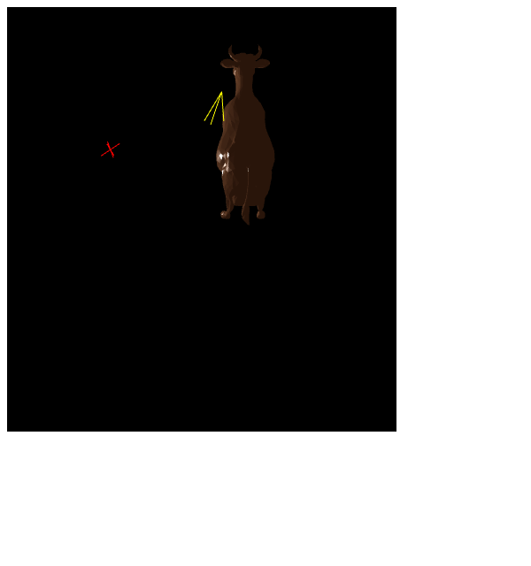
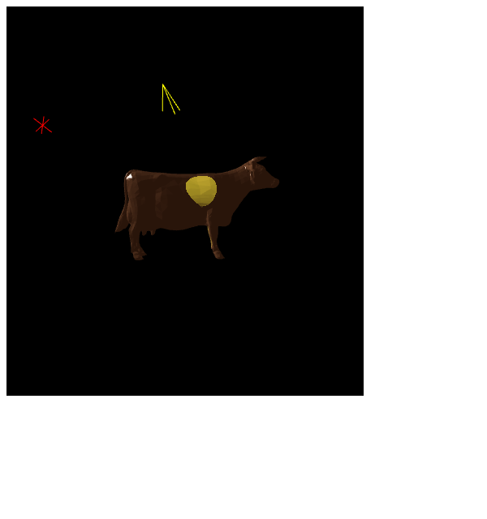

# Interactive Rotating Cow

A real-time 3D WebGL application that renders an interactive cow model with Phong lighting, a global light source, and a sweeping spotlight. Built from scratch using raw WebGL2 and GLSL shaders — no libraries or 3D engines.



---

## Features

- **Phong lighting model** — ambient, diffuse, and specular components computed per-fragment in GLSL
- **Global light source** — orbits the scene when toggled; visualized as a red wireframe marker
- **Spotlight** — sweeps left and right automatically when toggled; visualized as a yellow wireframe cone
- **Full 6-DOF interaction** — translate along X/Y (left-drag), translate along Z (arrow up/down), rotate along X/Y (right-drag), rotate along Z (arrow left/right)
- **One-key reset** — press `r` to snap the cow back to the origin in its default orientation
- **Raw WebGL2** — vertex and fragment shaders written in GLSL, compiled and linked at runtime; no Three.js, no Babylon.js

---

## Tech Stack

| Layer | Technology |
|---|---|
| Language | JavaScript |
| Graphics API | WebGL2 |
| Shading | GLSL (vertex + fragment shaders) |
| Math Library | MV.js (Angel & Shreiner) |
| Cow Geometry | cow.js — 8700+ lines of vertex/face data |
| Markup | HTML5 Canvas |

---

## Controls

| Input | Action |
|---|---|
| Left-drag mouse | Translate cow along X and Y |
| Right-drag mouse | Rotate cow along X and Y |
| Up / Down arrow keys | Translate cow toward / away from camera (Z axis) |
| Left / Right arrow keys | Rotate cow counter-clockwise / clockwise (Z axis) |
| `p` | Toggle global light source orbiting |
| `s` | Toggle spotlight sweeping |
| `r` | Reset cow to origin |

---

## Getting Started

No build step required — open directly in a browser that supports WebGL2.

```bash
git clone https://github.com/arvinbm/Rotating_Cow.git
cd Rotating_Cow
npx serve .
```

Then open `http://localhost:3000` in Chrome or Firefox.

Alternatively, open `index.html` directly from the filesystem — no server needed.

---

## Lighting Model

The fragment shader implements a three-component Phong model:

- **Ambient** — constant base colour `(0.52, 0.37, 0.26)` scaled by 0.6
- **Diffuse** — dot product of surface normal and direction to the global light source
- **Specular** — half-vector Blinn-Phong highlight with configurable shininess (default 200)
- **Spotlight** — additive yellow-tinted contribution `(0.5, 0.5, 0.1)` applied inside the cone (7.5° half-angle, cosine test)

---

## Screenshots

### Default View


### Rotation (right-drag)


### Global Light Orbiting (`p`)


### Spotlight Active (`s`)


### Translation (left-drag)


### After Reset (`r`)


---

## Bug Fixes

Two bugs were fixed from the original submission:

1. **Depth buffer not cleared each frame** — `gl.clear` was only clearing `COLOR_BUFFER_BIT`. With depth testing enabled, the depth buffer accumulated stale values across frames, causing z-fighting artifacts during rotation. Fixed: `gl.clear(gl.COLOR_BUFFER_BIT | gl.DEPTH_BUFFER_BIT)`.

2. **`gl.clearColor` called after `gl.clear`** — the clear colour was set to black *after* the buffer was already cleared, so the first frame always rendered grey instead of black. Fixed by moving `gl.clearColor` before `gl.clear`.

---

## Notes

- Requires a browser with WebGL2 support (Chrome 56+, Firefox 51+, Safari 15+)
- The cow geometry (`cow.js`) is a standard benchmark mesh
- Shader source is stored as string arrays in `app.js` and compiled at runtime via `gl.compileShader`
